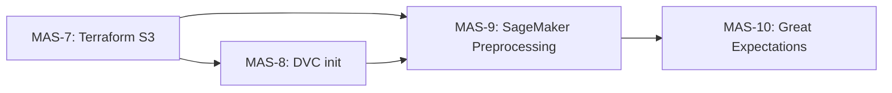

# PixelSense: MAS-7 → MAS-10 Plan

## Repo state

Currently: README vision, two data-sourcing scripts, minimal `requirements.txt`. No Terraform, no DVC, no ML pipeline code.

---

## MAS-7 — Versioned S3 buckets with Terraform

New directory: `infra/terraform/`

**Buckets to provision:**

- `pixelsense-data` — raw + DVC-tracked assets (versioning ON, AES256, lifecycle: archive to Glacier after 90d)
- `pixelsense-artifacts` — model checkpoints, SageMaker outputs (versioning ON, AES256)

**Files:**

- `[infra/terraform/versions.tf](infra/terraform/versions.tf)` — provider pins (`aws ~> 5.0`, `terraform >= 1.7`)
- `[infra/terraform/variables.tf](infra/terraform/variables.tf)` — `aws_region`, `project`, `environment`
- `[infra/terraform/main.tf](infra/terraform/main.tf)` — two `aws_s3_bucket` resources with `aws_s3_bucket_versioning`, `aws_s3_bucket_server_side_encryption_configuration`, `aws_s3_bucket_lifecycle_configuration`, and public-access blocks
- `[infra/terraform/outputs.tf](infra/terraform/outputs.tf)` — bucket names + ARNs
- `[infra/terraform/terraform.tfvars.example](infra/terraform/terraform.tfvars.example)` — non-secret defaults

`.gitignore` already covers `*.tfstate`, `*.tfvars`, `.terraform/`.

---

## MAS-8 — Initialize DVC with S3 remote

DVC init at repo root, remote pointing to the `pixelsense-data` bucket from MAS-7.

**Changes:**

- Run `dvc init` → creates `.dvc/`
- Configure remote: `dvc remote add -d s3remote s3://pixelsense-data/dvc-store`
- Add `data/pixel_art/` and `data/photorealistic/` as DVC-tracked paths
- `dvc.yaml` with a `source` stage wrapping the two existing sourcing scripts
- `requirements.txt` — add `dvc[s3]>=3.0`

**New files:** `.dvc/config`, `data/.gitkeep`, `dvc.yaml`, `dvc.lock` (after first `dvc repro`)

---

## MAS-9 — SageMaker Processing Job for image preprocessing

New directory: `pipelines/preprocess/`

`**pipelines/preprocess/preprocess.py`** (runs inside SageMaker container):

- Reads from `/opt/ml/processing/input/{pixel_art,photorealistic}`
- Resize → 256×256, normalize to `[-1, 1]` (CycleGAN convention)
- Deterministic 80/10/10 train/val/test split (seeded)
- Writes NumPy `.npy` shards to `/opt/ml/processing/output/{train,val,test}`
- Deps: `Pillow`, `numpy`, `scikit-learn` (stratified split)

`**pipelines/preprocess/run_job.py**` (local launcher):

- Uses `sagemaker.processing.ScriptProcessor` with `SKLearnProcessor`
- Inputs: S3 paths from `pixelsense-data` bucket
- Outputs: to `pixelsense-artifacts/processed/`
- Parameterized via argparse (`--env`, `--instance-type`)

`**requirements.txt**` additions: `sagemaker>=2.200`, `boto3>=1.34`, `numpy>=1.26`, `scikit-learn>=1.4`

---

## MAS-10 — Data validation with Great Expectations

New directory: `validation/`

`**validation/setup_ge.py**` — one-time setup script:

- Creates a GE `FileSystemDataContext` at `validation/gx/`
- Defines two Expectation Suites: `pixel_art_suite`, `photorealistic_suite`
- Expectations per suite:
  - `expect_column_values_to_be_between` (pixel values `[-1, 1]`)
  - `expect_table_columns_to_match_ordered_list` (shape: `[H, W, C]`)
  - `expect_column_values_to_not_be_null`
  - Custom: image dimensions exactly 256×256

`**validation/validate_batch.py**` — called post-preprocessing:

- Loads processed `.npy` batch, runs GE checkpoint
- Exits non-zero on failure (CI-friendly)

`**requirements.txt**` addition: `great-expectations>=0.18`

`.gitignore` already covers `gx/uncommitted/`.

---

## Execution order

MAS-7 and MAS-8 are coupled (DVC remote needs the bucket). MAS-9 depends on both. MAS-10 validates MAS-9 output.